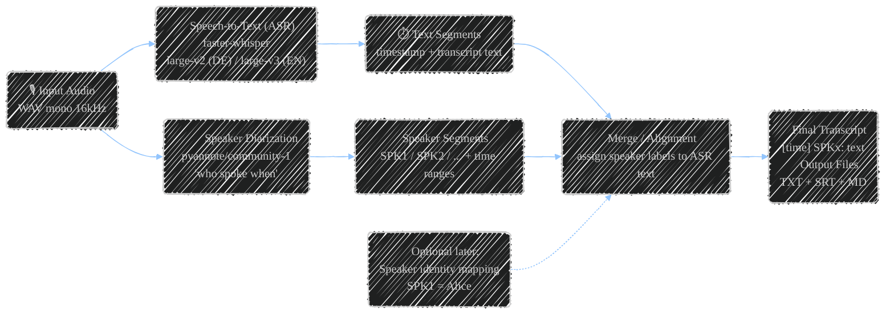

# meeting-transcriber

Local Windows meeting transcription project:
- Record meetings as WAV (mono, 16 kHz) using `ffmpeg`
- Speech-to-text with `faster-whisper`
- Speaker diarization with `pyannote-audio`
- Outputs: `.txt`, `.srt`, `.md`

Goal: run **locally**, use GPU acceleration when available (CUDA), otherwise CPU fallback.

---

## Requirements

- Windows 10/11
- [Miniforge3](https://github.com/conda-forge/miniforge) (with `mamba`)
- `ffmpeg` available on the machine
- Optional: NVIDIA GPU + current drivers for CUDA acceleration
- Hugging Face token for diarization (`pyannote` models)

### Install Miniforge3 via winget

Install Miniforge3 on Windows:

```powershell
winget install --id CondaForge.Miniforge3 --exact
```

Then open a new terminal and verify:

```powershell
mamba --version
```

### Install FFmpeg (Gyan build) via winget

Install FFmpeg from Gyan.dev package on Windows:

```powershell
winget install --id Gyan.FFmpeg --exact
```

Then verify:

```powershell
ffmpeg -version
```

---

## Environments (portable Windows setup)

Two environment profiles are provided:

- **`environment-cuda.yml`** → use this on systems with NVIDIA GPU (CUDA)
- **`environment-cpu.yml`** → use this on systems without CUDA / NVIDIA

You only need to create **one** environment per machine.

### Option A: CUDA machine (NVIDIA)

```powershell
mamba env create -f environment-cuda.yml
mamba activate meeting-transcriber-cuda
```

### Option B: CPU-only machine

```powershell
mamba env create -f environment-cpu.yml
mamba activate meeting-transcriber-cpu
```

---

## Set Hugging Face token

PowerShell (temporary for current session):

```powershell
$env:HUGGINGFACE_TOKEN = "hf_xxx..."
```

Optional additional settings:

```powershell
$env:DIARIZATION_MODEL = "pyannote/speaker-diarization-community-1"
$env:ASR_MODEL = "large-v2"  # recommended for German; use large-v3 for English
$env:LANGUAGE = "de"         # or "auto"
```

---

## List available audio devices (DirectShow)

```powershell
ffmpeg -list_devices true -f dshow -i dummy
```

Use the reported audio device name/identifier in `-i "audio=..."`.

---

## Record audio

Use the PowerShell helper function (`recmeet`).

Repository includes `function Start-MeetingRec.ps1`.

```powershell
. .\function Start-MeetingRec.ps1
recmeet -Meeting "Project Kickoff"
```

This creates a WAV file in `$HOME\Recordings` by default.

---

## Run transcription + diarization

```powershell
python .\transcribe_meeting.py "C:\Users\<USER>\Recordings\2026-03-05_09-00__Project_Kickoff.wav"
```

Generated files (next to the WAV):
- `*_transcript.txt`
- `*_transcript.srt`
- `*_transcript.md`

---

## Pipeline overview



---

## Important parameters (env vars)

- `ASR_MODEL` (default: `large-v3-turbo`)
- `LANGUAGE` (default: `en`, for German typically `de` or `auto`)

### Recommended ASR model by language

Based on current project testing:
- **German meetings**: `ASR_MODEL=large-v2`
- **English meetings**: `ASR_MODEL=large-v3`

Example (German):

```powershell
$env:LANGUAGE = "de"
$env:ASR_MODEL = "large-v2"
```

Example (English):

```powershell
$env:LANGUAGE = "en"
$env:ASR_MODEL = "large-v3"
```
- `ASR_VAD_FILTER` (default: `true`)
- `ASR_VAD_MIN_SILENCE_MS` (default: `300`)
- `ASR_BEAM_SIZE` (default: `5`)
- `ASR_NO_SPEECH_THRESHOLD` (default: `1.0`)
- `ASR_LOGPROB_THRESHOLD` (default: `-1.0`)
- `ASR_TEMPERATURE` (default: `0.0`)
- `ASR_CONDITION_ON_PREVIOUS_TEXT` (default: `true`)
- `ASR_INITIAL_PROMPT` (optional)
- `DIARIZATION_MODEL` (default: `pyannote/speaker-diarization-community-1`)

### What `ASR_INITIAL_PROMPT` does and how to use it

`ASR_INITIAL_PROMPT` is a startup hint for Whisper. It gives the model context before transcription starts.

Use it to improve recognition of:
- domain-specific terms (e.g. PKI, OCSP, CRL, ADCS)
- company/product names
- person names and recurring vocabulary

PowerShell example:

```powershell
$env:ASR_INITIAL_PROMPT = "This is a German IT meeting about PKI, certificates, HSM, Active Directory."
python .\transcribe_meeting.py "C:\Users\<USER>\Recordings\2026-03-05_09-00__Project_Kickoff.wav"
```

Notes:
- Keep the prompt short and specific (1–3 sentences).
- It is a hint, not a strict custom dictionary.

---

## Troubleshooting

### `HUGGINGFACE_TOKEN is not set`
Set the token as env var (see above).

### CUDA is not used
- Check NVIDIA drivers
- Confirm CUDA profile (`meeting-transcriber-cuda`) is active
- Check script output (`CUDA available: True/False`)

### Audio device not visible in ffmpeg
1. Show devices via ffmpeg:
   ```powershell
   ffmpeg -list_devices true -f dshow -i dummy
   ```
2. Open classic Sound control panel:
   ```powershell
   mmsys.cpl
   ```
3. In **Recording** tab, right-click inside the device list and enable:
   - **Show Disabled Devices**
   - **Show Disconnected Devices**
4. Enable the required device and set permissions in Windows privacy settings:
   - **Settings → Privacy & security → Microphone**
   - Allow microphone access (system + desktop apps)

### German transcription quality is poor
- Try `LANGUAGE=de`
- Optionally set `ASR_INITIAL_PROMPT` with domain-specific terms

---

## Roadmap / To-Do

- [ ] HF cache + true offline mode (after initial model download)
  - Ensure models can be reused fully offline after the initial fetch.
- [ ] Audio device configuration without hardcoding
  - Make input device selection configurable instead of fixed IDs.
- [ ] Optional mapping of speaker labels (`SPK1`) to real names
  - Persist speaker aliases so transcripts stay human-readable.
- [ ] CLI wrapper (e.g. `transcribe.ps1`) for simpler execution
  - Provide a single command entry point with sane defaults.
- [ ] Progress reporting per phase (ASR / diarization / merge) with runtime stats
  - Show transparent per-step progress and timing for long jobs.
- [ ] Graceful cancel/abort handling for long-running transcriptions
  - Allow safe interruption without corrupting outputs.
- [ ] Batch/queue mode for processing multiple files in one run
  - Process folders of recordings automatically in sequence.
- [ ] Optional watch mode for a recordings folder
  - Auto-start processing when new recordings appear.
- [ ] JSON export for downstream automation workflows
  - Output structured machine-readable transcript data.
- [ ] Optional additional export formats (HTML/DOCX)
  - Support easier sharing and documentation workflows.
- [ ] Post-processing dictionary (search/replace for recurring domain terms)
  - Standardize frequent terms, names, and abbreviations.
- [ ] Merge-by-sentence post-processing option
  - Improve readability by merging fragmented segments.
- [ ] Speaker review workflow (label correction + mapping persistence)
  - Enable manual speaker fixes and reuse them later.
- [ ] Optional video input support (extract audio from MP4/MKV/MOV)
  - Accept video files directly by extracting audio with ffmpeg.
- [ ] Subtitle metrics (CPS/WPM/segment duration) for readability checks
  - Add subtitle quality indicators for pacing and legibility.
- [ ] Optional SMPTE/custom timecode mode for media workflows
  - Provide frame-accurate timing for editing/broadcast use cases.

---

## Acknowledgments

Special thanks to the projects and teams behind the core building blocks used here:

- OpenAI Whisper: https://github.com/openai/whisper
- pyannote-audio: https://github.com/pyannote/pyannote-audio

## License

Licensed under the Apache License 2.0. See [LICENSE](./LICENSE).

Third-party components keep their own licenses (e.g., MIT). See:
- [NOTICE](./NOTICE)
- [THIRD_PARTY_LICENSES.md](./THIRD_PARTY_LICENSES.md)
